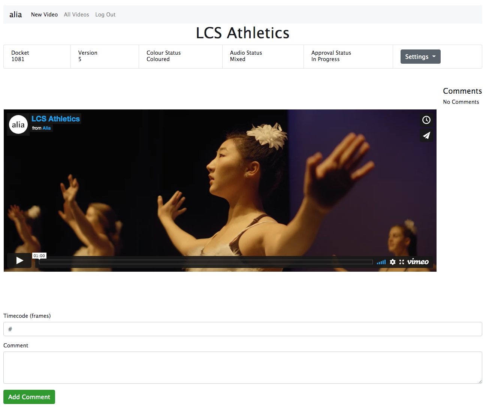
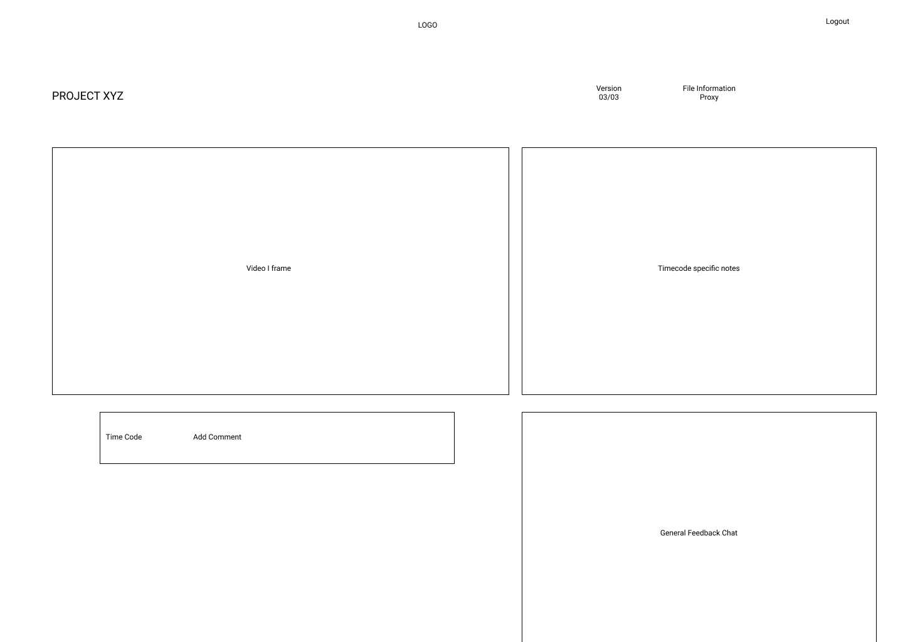
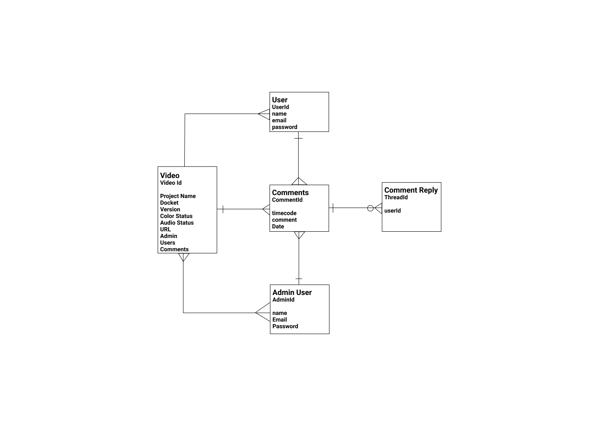

# VidReview

A client feedback portal for editors and small production companies.

## [Launch App](https://video-reviewer-app.herokuapp.com/)

## App Screenshots

## Technologies Used

- HTML & Bootstrap
- JS & JQuery
- Built with Express in node.js
- Mongo db
- Launched on Heroku with Atlas

## Getting Started

Login in with Google.
Create a new video project and fill in the relevant details.
Share the video page link with your client and team for comments.

## Planned Features

- Add dedicated company logins
- Add threaded comment replies
- Allow users to mark comments as complete
- Implement timecode references
- Allow users to upload videos to Vimeo directly from the app

## Wire Frame & ERD

